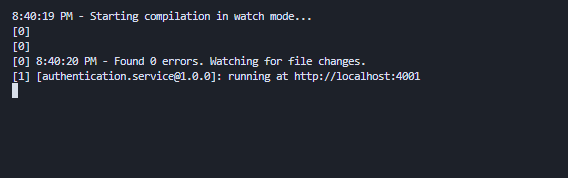

# How to create a microservice in ExpressJS 📝

Every microservice can be in different language and frameworks. With ExpressJS, one can choose multiple languages like JavaScript and TypeScript.

## Get Started 🚀

Firstly identify and cluster the microservice such as `authentication`, `administration`, `inventory` etc.

Create a folder for your microservice in the `/src/services` directory specifying the version. Maybe there will be a different version available with a different language or framework in future or, there can be break changes or pivot.

Make sure your are in root directory of the project.

```bash
  mkdir src/services/authentication/v1
  cd src/services/authentication/v1
```

Initialize developing the microservice using npm's initializer command to create a `package.json` file:

```bash
  npm init -y
```

When you initialize a package.json file, the --yes flag uses the default settings you have set up from npm config. The newly created package.json file might look something like the following code:

```json
{
	"name": "express-typescript",
	"version": "1.0.0",
	"description": "",
	"main": "index.js",
	"scripts": {
		"test": "echo \"Error: no test specified\" && exit 1"
	},
	"type": "module",
	"keywords": [],
	"author": "",
	"license": "ISC"
}
```

## Create a Minimal server with Express

After initializing the `package.json` file, let’s add an Express package. From the terminal window, run the command below:

```bash
  npm install express dotenv -E
```

Use `-E` to lock the packages version.

Next, to trigger a minimal server, create a new file called `index.js` at the root of the project with the following code:

```javascript
const express = require("express");
const dotenv = require("dotenv");

dotenv.config();

const app = express();
const port = process.env.PORT;

app.get("/", (req, res) => {
	res.send("Express + TypeScript Server");
});

app.listen(port, () => {
	console.log(
		`[${process.env.npm_package_name}@${process.env.npm_package_version}]: running at http://localhost:${port}`
	);
});
```

The dotenv package is used to read environment variables from the `.env` file. Create it in the root of your Node.js app, then create the environment variable for `PORT=8000`. also create `template.env` where the template of environment file can be placed. this will make it better for realizing the environment variables list later.

Also the dotenv package will read package name and version from `package.json` file.

`.env` file will look like this:

```
PORT=8000
```

and `template.env` file will look like this:

```
PORT=
```

# Installing TypeScript ⚡️

Open the terminal window and install the packages described above with the following command:

```bash
  npm i -D typescript @types/express @types/node -E
```

The -D flag, also known as the --dev flag, is a specification for the package manager to install these libraries as devDependencies.

Once these libraries are installed, go to the package.json file where you’ll see a new devDependencies object:

```json
{
	"devDependencies": {
		"@types/express": "4.17.13",
		"@types/node": "17.0.10",
		"typescript": "4.5.5"
	}
}
```

## Generating `tsconfig.json`

Now, we have a TypeScript project compiled with some default configuration options. The tsconfig.json file provides these default options and also provides us with the ability to tweak or customize the compiler options.

Typically, the `tsconfig.json` file lives at the root of the project. To generate it, we’ll use the tsc command:

```bash
  npx tsc --init
```

The command above will generate a new file called tsconfig.json with the following default compiler options:

```json
{
	"target": "es2016",
	"module": "commonjs",
	"strict": "true",
	"esModuleInterop": "true",
	"skipLibCheck": "true",
	"forceConsistentCasingInFileNames": "true"
}
```

One option that you will have to enable is called `outDir`, which specifies where the output will be located after the compilation step. You can search for this option in the `tsconfig.json` file and uncomment it.

By default, the value of this option is set to the root directory. Change it to `dist`:

```json
{
	"compilerOptions": {
		"outDir": "./dist"

		// rest options remain same
	}
}
```

While there are probably other configuration options that you can add on to the TypeScript compiler, the options listed above are basic specifications that can help you get started.

## Create an Express server with a `.ts` extension

Now, you can easily convert the minimal server code in `index.js` to an `index.ts` file.

First, rename the file to `index.ts`. The `.ts` extension is a file extension that determines what TypeScript files are compiled to JavaScript files later when we build the server.

Open the index.ts file and modify it, as shown below:

```typescript
import express, { Express, Request, Response } from "express";
import dotenv from "dotenv";

dotenv.config();

const app: Express = express();
const port = process.env.PORT;

app.get("/", (req: Request, res: Response) => {
	res.send("Express + TypeScript Server");
});

app.listen(port, () => {
	console.log(
		`[${process.env.npm_package_name}@${process.env.npm_package_version}]: running at http://localhost:${port}`
	);
});
```

## Watching file changes and build directory

Another development-related utility library I like to use when working on Node.js projects is `nodemon`. nodemon is a tool that helps develop Node.js based applications by automatically restarting the Node.js application when file changes in the directory are detected.

We’ll also install another dev dependency called `Concurrently`, which will allow us to run multiple commands like nodemon to watch file changes and the tsc command to compile the code:

```bash
npm install -D concurrently nodemon -E
```

After installing these dev dependencies, update the scripts in the package.json file:

```json
{
	"scripts": {
		"build": "npx tsc",
		"start": "node dist/index.js",
		"dev": "concurrently \"npx tsc --watch\" \"nodemon -q dist/index.js\""
	}
}
```

The build command will compile the code in JavaScript inside a `dist` directory of the service. The dev command is used to run the Node.js server in development mode.

Now, go back to the terminal window and run `npm run dev` to trigger the development server:

Run build command for the first time.

```bash
npm run build
```

```bash
npm run dev
```



For production mode run:

```bash
npm run start
```
